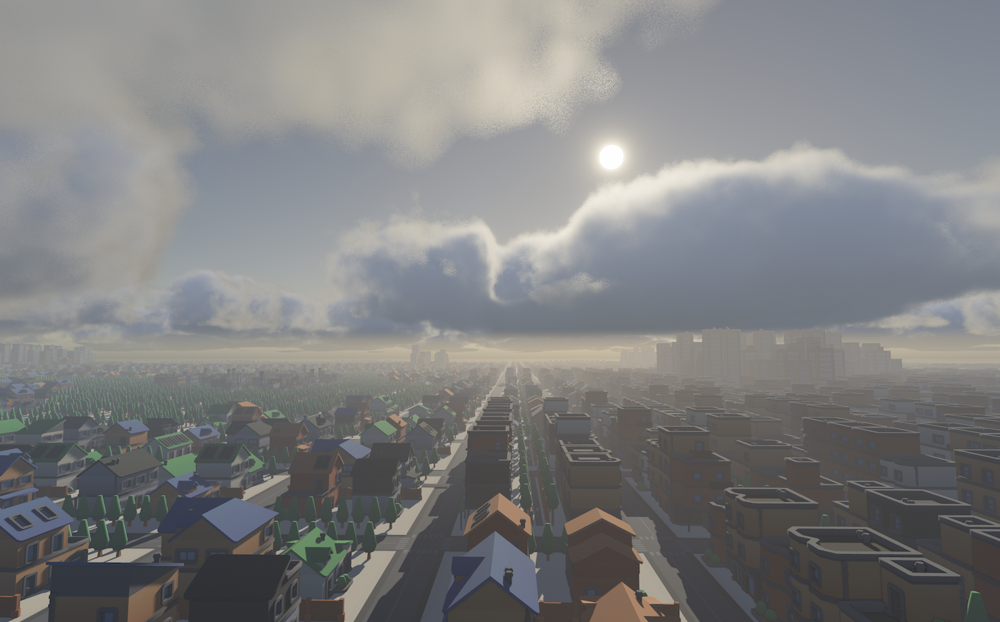

# Flecs engine
A fast, portable, low footprint, opinionated (but hackable), flecs native game engine.

The project is still WIP. Native macOS and Windows are supported targets, and
Linux native support is still pending.

## Usage
Build & run the engine:
```sh
cmake -S . -B build/debug
cmake --build build/debug
./build/debug/flecs
```

### Windows
On Windows, use the Visual Studio developer command prompt or call
`vcvars64.bat` before configuring with CMake. The native build expects:

- MSVC
- CMake
- Ninja
- Rust/Cargo for the `wgpu-native` fallback build

Example:
```powershell
cmake -S . -B build/windows -G Ninja
cmake --build build/windows
.\build\windows\flecs.exe
```

### Building with bake3
The project can also be built with [bake3](../../bake3). bake fetches and builds
the external dependencies (glfw, cglm, wgpu-native, stb, tinyexr, cgltf, flecs)
automatically via its `bundle` feature. Build and run an executable (the `flecs_app` target produces the `flecs` binary):
```sh
bake run flecs_app --local-env
bake run traffic --local-env
```
Build an executable (and the `flecs_engine` library it depends on) without running:
```sh
bake build flecs_app --local-env
bake build traffic --local-env
```

#### WebAssembly with bake3
bake3 can also cross-compile to WebAssembly with `--target em`:
```sh
bake build flecs_app --target em --local-env
bake build traffic --target em --local-env
```
This produces `flecs.html` / `flecs.wasm` / `flecs.js` (and `traffic.*`) under
`.bake/local_env/build/<app>/wasm32-Emscripten-debug/`. bake automatically
locates and activates the Emscripten SDK; if `emcc` is not already on `PATH` it
sources `emsdk_env.sh` from `$EMSDK`, `$EMSDK_DIR`, or `~/GitHub/emsdk`. On this
target bake builds the dependency bundles with `emcmake`, skips the native
GLFW/WebGPU dependencies, and uses Emscripten's `-sUSE_GLFW=3 -sUSE_WEBGPU=1`
ports instead.

## Why should I use this?
You should probably not use this, unless:
- you want to quickly prototype ideas
- you want to build an engine but not start from 0
- you're OK with the limitations of the engine

## Features

### Geometry
- Primitive shapes:
  - Quad
  - Box
  - Triangle
  - TrianglePrism
  - RightTriangle
  - RightTrianglePrism
- Primitive meshes (parameterized mesh cache):
  - Cone
  - Cylinder
  - Sphere
  - IcoSphere
  - HemiSphere
  - NGon
- Meshes
- Instanced rendering

### Assets
- glTF loader
- PNG loader
- DDS loader
- HDR / EXR loader (for HDRI)

### Materials
- Metallic
- Roughness
- Cubemap based reflections
- Emissive
- Transmissive (rough/smooth objects)
- PBR textures
- Per-instance materials
- Shared materials

### Lighting
- Directional light
- Point lights
- Spot lights
- Clustered light rendering
- Cascading shadow maps
- Image based lighting

### Atmosphere
- Dynamic atmosphere
- Dynamic atmosphere IBL
- Distance fog
- Height based fog
- Sun disk
- Moon disk (w/phases)
- Starfield
- Time of day system

### Effects
- Bloom
- SSAO
- Screen space sun shafts
- Auto exposure
- Tony McMapFace tone mapping

### Misc
- Input handling
- Camera controller
- Movement systems
- Tracy profiling
- Image-based rendering regression testing
- MSAA
- GPU frustum culling
- Hi-Z occlusion culling
- Render to image

## Dependencies
- cglm
- cgltf
- glfw
- stb_image
- tinyexr
- tracy

## Assets used
- [Kronos sample assets](https://github.com/KhronosGroup/glTF-Sample-Assets)
- [Niagra bistro](https://github.com/zeux/niagara_bistro)
- [Kenney](https://kenney.nl/)

## Screenshots



